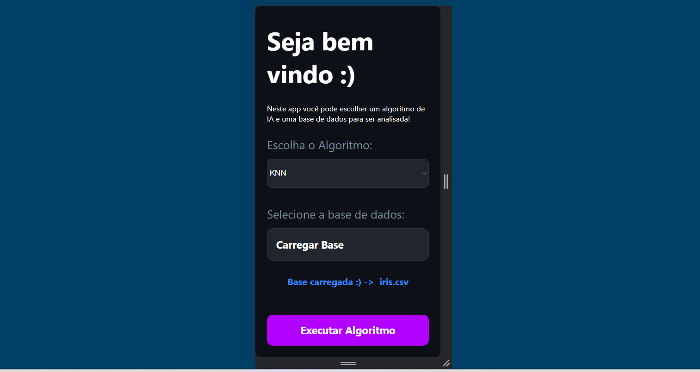
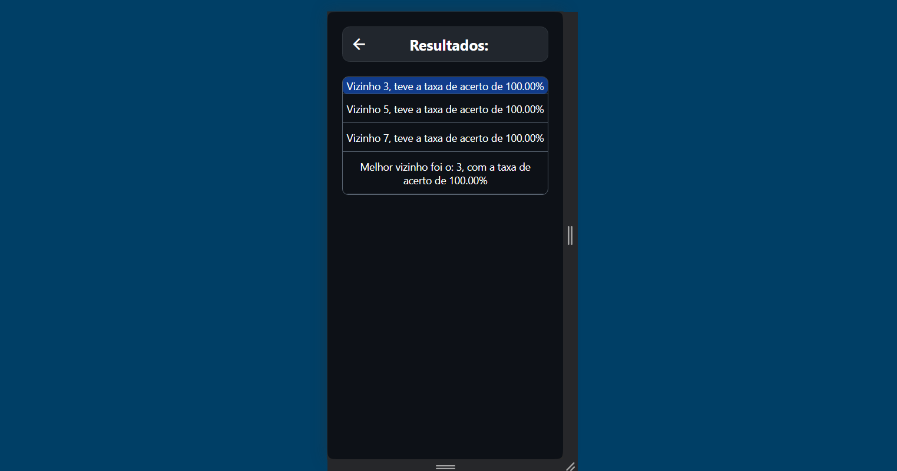
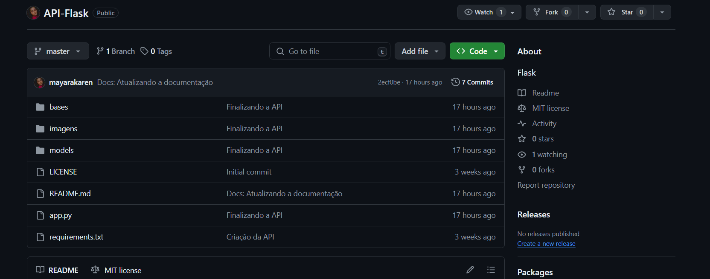

# Machine Learning App :)
This application made in React Native was created to study the concepts of machine learning classes, from the Multiplatform Software Development course at Fatec Registro.

This is an [Expo](https://expo.dev) project created with [`create-expo-app`](https://www.npmjs.com/package/create-expo-app).
<br>


## Get started

1. Install dependencies

   ```bash
   npm install
   ```

2. Start the app

   ```bash
    npx expo start
   ```

In the output, you'll find options to open the app in a

- [development build](https://docs.expo.dev/develop/development-builds/introduction/)
- [Android emulator](https://docs.expo.dev/workflow/android-studio-emulator/)
- [iOS simulator](https://docs.expo.dev/workflow/ios-simulator/)
- [Expo Go](https://expo.dev/go), a limited sandbox for trying out app development with Expo

## Get a fresh project

When you're ready, run:

```bash
npm run reset-project
```

This command will move the starter code to the **app-example** directory and create a blank **app** directory where you can start developing.

## How it works?
You choose the algorithm (KNN, Decision Tree or Genetic Algorithm) and the data base. Then, you will be redirected to the results page:
<br>



## Flask API
This project uses the Flask API developed by [Mayara Karen](https://github.com/mayarakaren), whose repository you can find here: [API flask](https://github.com/mayarakaren/API-Flask.git).
There you will find instructions for installing the API. Don't forget to change the IP addresses of calls to your machine's address, as it runs locally.
<br>

